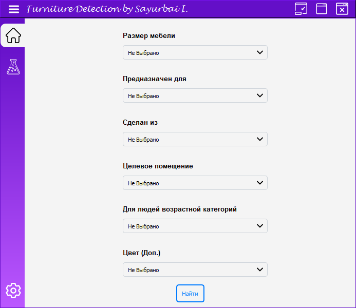

# Furniture Similarity Detector

Welcome to the Furniture Similarity Detector project! This program utilizes computer vision techniques to help you find similar furniture items based on selected attributes. It was created as part of a class project and aims to demonstrate the concept of computer vision in a practical scenario.

## Features

- Detects similarity with pre-defined furniture items using selected attributes.
- Fetches images of similar furniture items from the internet using Selenium.
- Displays similarity scores and images in a PyQt graphical user interface.

## Screenshots

### Loader

### Main Window and Menu

### Request

### Results

  

    
  

  

    
  

  

    
  

  

    
  

## Requirements

- Python 3.x
- PyQt
- Selenium
- Internet connection for fetching images

## Usage

1. Clone this repository to your local machine.
2. Install the required Python packages using `pip install -r requirements.txt`.
3. Run the program using `python main.py`. Or Compile it with `pyinstaller main.py` and run the executable.
4. Select attributes for the furniture item you're looking for.
5. Click the "Search" button to find similar furniture items.
6. View the results along with their similarity scores and images.

Please note that this program was developed as part of an educational project and might have limitations or areas for improvement.

Feel free to modify and enhance the program according to your needs! If you have any questions or suggestions, don't hesitate to reach out. Happy coding! 😄🛋️
